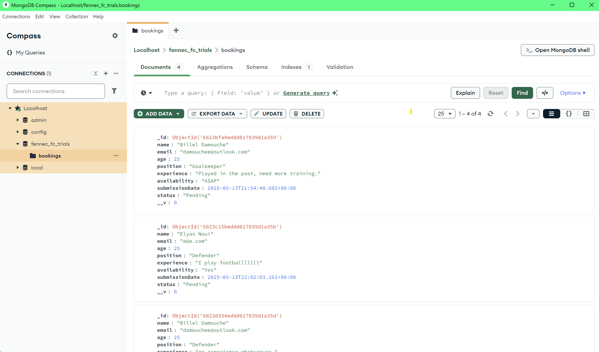

# Fennec FC Trial Booking System

A full-stack application for processing trial booking requests for Fennec FC. This application includes:

- Server-side form validation
- Database integration with MongoDB
- Email notifications
- Object-oriented programming approach

## Technologies Used

### Backend
- Node.js
- Express.js
- MongoDB with Mongoose
- Express Validator for server-side validation
- Nodemailer for sending confirmation emails
- dotenv for environment variables

### Frontend
- HTML5
- CSS3
- JavaScript (Vanilla)

## Features

1. **Form Validation**
   - Client-side validation for immediate feedback
   - Server-side validation for security
   - Comprehensive error handling

2. **Database Integration**
   - MongoDB for storing booking requests
   - Mongoose ODM for data modeling
   - Schema validation for data integrity

3. **Email Notifications**
   - Automated confirmation emails to users
   - Email template with booking details

4. **Security Measures**
   - Input sanitization
   - Server-side validation
   - Environment variables for sensitive data

## Database Implementation

The application successfully stores booking submissions in MongoDB as shown below:



As demonstrated in the screenshot, the system captures all essential player information:

## Project Structure

```
SOURCE CODE/
│
├── public/                  # Static assets
│   ├── css/                 # CSS stylesheets
│   │   └── book.css         # Styling for booking form
│   ├── js/                  # Client-side JavaScript
│   │   └── book.js          # Form validation and submission
│   └── book.html            # Booking form HTML
│
├── models/                  # Database models
│   └── Booking.js           # Mongoose schema for bookings
│
├── server.js                # Main Express application
├── .env                     # Environment variables (not in version control)
├── package.json             # Project dependencies
└── README.md                # Project documentation
```

## Installation
1. Clone the repository:
   ```
   git clone https://github.com/Damouche-Billel/University-Assignment-4FSC0WE004.git
   cd "CODE SNIPPETS"
   ```

2. Install dependencies:
   ```
   npm install
   ```

3. Create a `.env` file based on the provided `.env.example` with your own values.

4. Start the server:
   ```
   npm run dev
   ```

5. Access the application at `http://localhost:3000`

## API Endpoints

### POST /submit-trial
Processes a new trial booking request.

**Request Body:**
```json
{
  "name": "Billel Damouche",
  "email": "billel.damouche@outlook.com",
  "age": 18,
  "position": "Midfielder",
  "experience": "I have played for my school team for 3 years and participated in regional tournaments.",
  "availability": "Weekends and Wednesday evenings"
}
```

**Success Response:**
```json
{
  "success": true,
  "message": "Thank you for your submission! We will contact you soon about your trial."
}
```

**Error Response:**
```json
{
  "success": false,
  "errors": [
    {
      "param": "email",
      "msg": "Please enter a valid email address"
    }
  ]
}
```

## Validation Rules

The application enforces the following validation rules:

1. **Name**
   - Required
   - Must contain at least two words (first and last name)

2. **Email**
   - Required
   - Must be a valid email format

3. **Age**
   - Required
   - Must be at least 16 years old

4. **Position**
   - Required
   - Must be one of: Goalkeeper, Defender, Midfielder, Forward

5. **Experience**
   - Required
   - Must be at least 20 characters long

6. **Availability**
   - Required

## Database Schema

The MongoDB collection uses the following schema:

```javascript
{
  name: String,           // Applicant's full name
  email: String,          // Contact email
  age: Number,            // Age (minimum 16)
  position: String,       // Preferred playing position
  experience: String,     // Previous experience description
  availability: String,   // Availability for trials
  submissionDate: Date,   // When the application was submitted
  status: String          // Application status (Pending, Approved, Rejected, Completed)
}
```

## Future Improvements

- Admin dashboard for managing booking requests
- User account creation for tracking application status
- Calendar integration for scheduling trials
- File upload for previous achievement certificates
- SMS notifications

## License

MIT License

## Repository Link
You can access the full repository here: [University-Assignment-4FSC0WE004](https://github.com/Damouche-Billel/University-Assignment-4FSC0WE004/tree/main/CODE%20SNIPPETS)
